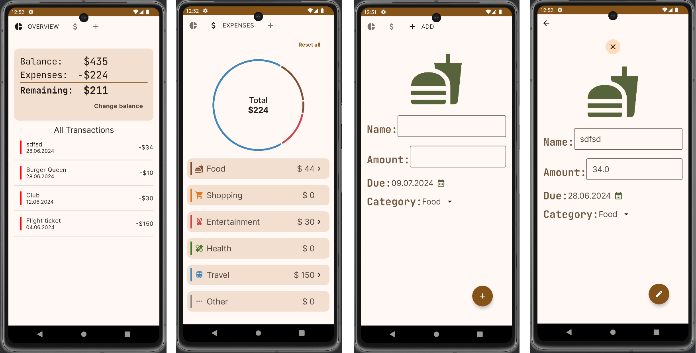

# SpendWise

SpendWise is a mobile application that allows users to categorize and closely monitor their expenses.

## Overview

SpendWise helps users better manage their spending and understand their financial situation. The application categorizes expenses and helps users gain financial awareness.

## Screenshots

## Technologies Used

- Jetpack Compose
- MVVM Architecture
- Navigation Component
- Hilt & Dagger
- Room
- Preferences DataStore
- Coroutine
- Flow
